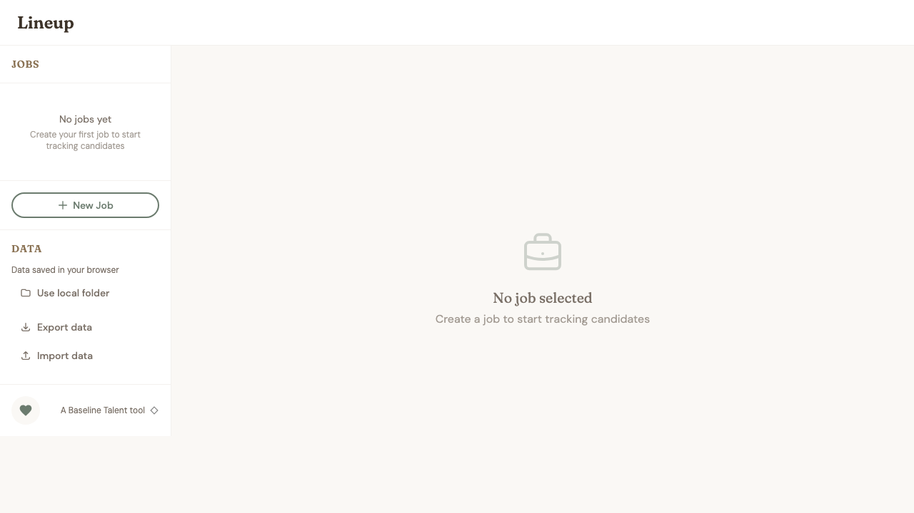

# Lineup

A privacy-first, open-source applicant tracking system for small teams who aren't ready for enterprise ATS platforms.

**Your data stays on your machine.** All candidate information is stored locally as readable JSON files. No server, no accounts, no data collection.

<p align="center">
  <a href="https://lineup.baselinetalent.xyz"><strong>Try Lineup Now →</strong></a>
</p>

<p align="center">
  
</p>

## Why Lineup?

Most ATS platforms require:
- Monthly subscriptions
- Storing candidate data on third-party servers
- Complex setup and onboarding

**Lineup is different:**
- **Free and open source** - Use it forever, modify it freely
- **Privacy by design** - Data never leaves your computer
- **Simple and fast** - No accounts, no setup, just start tracking

## It's Yours

Lineup is released under the MIT License. That means you can:

- **Fork it** and make it your own
- **Self-host it** on your own domain
- **Modify it** however you want
- **Remove all Baseline branding** if you prefer
- **Use it commercially** without asking permission

We built this after talking to a tech leader who was tracking candidates in Google Sheets. Maybe something like this already exists—but we wanted a fun project, and there had to be something better that didn't require enterprise pricing or giving up your data. If you find it useful, it's yours to keep—forever. Even if we disappear tomorrow, your copy keeps working. No vendor lock-in, no dependencies on us.

```bash
# Fork it, clone it, own it
git clone https://github.com/phil-baseline/baseline-talent-lineup.git
npm install && npm run build
# Host the dist/ folder anywhere you want
```

## Features

### Kanban Board
Visualize your hiring pipeline with a drag-and-drop board:
- **Sourced** - Candidates you've identified
- **Interviewing** - Active interview process
- **Feedback** - Gathering team input
- **Offer** - Extending offers
- **Hired** - Successful hires

### Resume Parsing
Upload PDF or DOCX resumes and automatically extract:
- Name, email, phone
- Current title and company
- LinkedIn, GitHub, and portfolio links

The parser handles multiple resume formats:
- Company-first layouts
- Title-first layouts
- Combined "Company – Title" formats

### Local File Storage
Choose a folder on your computer to store all data:
```
lineup-data/
├── jobs/
│   └── job-uuid.json
├── candidates/
│   └── candidate-uuid.json
└── settings.json
```

Every file is human-readable JSON. Inspect, backup, or edit your data anytime.

### Export/Import
Share hiring pipelines with colleagues:
- Export all jobs and candidates to a single JSON file
- Import a colleague's export to sync state
- No server coordination required

## Getting Started

### Prerequisites
- Node.js 18+
- npm, yarn, or pnpm

### Installation

```bash
# Clone the repository
git clone https://github.com/phil-baseline/baseline-talent-lineup.git
cd baseline-talent-lineup

# Install dependencies
npm install

# Start development server
npm run dev
```

Open [http://localhost:5173](http://localhost:5173) in your browser.

### Building for Production

```bash
npm run build
```

The static files in `dist/` can be hosted anywhere (GitHub Pages, Netlify, Vercel, or just open `index.html` locally).

## Usage

### Creating a Job

1. Click **New Job** in the sidebar
2. Enter the job title (e.g., "Senior Software Engineer")
3. Add an optional description
4. Click **Create Job**

### Adding Candidates

**From a resume:**
1. Click **Add Candidate**
2. Drop a PDF or DOCX file in the upload zone
3. Review the auto-extracted information
4. Add tags and notes
5. Click **Add Candidate**

**Manually:**
1. Click **Add Candidate**
2. Fill in the candidate's details
3. Add LinkedIn/GitHub links
4. Click **Add Candidate**

### Managing the Pipeline

- **Drag cards** between columns to update candidate status
- **Click a card** to open the detail panel
- **Use the stage picker** on cards to quickly change status
- **Pass on candidates** to remove them from the active pipeline

### Using Local Storage

For persistent storage across sessions:
1. Click **Use local folder** in the sidebar
2. Select or create a folder for your data
3. All changes are automatically saved as JSON files

## Tech Stack

| Layer | Technology |
|-------|------------|
| Framework | React 18 + TypeScript |
| Build Tool | Vite |
| Styling | Tailwind CSS v4 |
| Drag & Drop | dnd-kit |
| PDF Parsing | pdf.js |
| DOCX Parsing | mammoth.js |
| State | Zustand |
| Storage | File System Access API + localStorage fallback |

## Project Structure

```
src/
├── components/
│   ├── Board/           # Kanban board, columns, cards
│   ├── CandidateDetail/ # Detail panel, add candidate modal
│   ├── Sidebar/         # Navigation, job list, support menu
│   └── common/          # Shared components (Modal, Tag, etc.)
├── hooks/               # Custom React hooks
├── lib/                 # Utilities (resume parser, file storage)
├── store/               # Zustand state management
└── App.tsx              # Main application component
```

## Design Philosophy

### Forest Floor Aesthetic
Lineup uses a warm, calming color palette inspired by nature:
- **Warm cream** background (#FAF8F5)
- **Forest sage** accents (#6B7B6E)
- **Deep brown** text (#3D3329)

### Typography
- **Headlines:** Fraunces (variable serif with character)
- **Body:** DM Sans (clean geometric sans)

### Signature Details
- **Floating cards** with subtle rotation (papers on a desk)
- **Paper grain** texture overlay for tactile feel
- **Spring animations** for satisfying drag-and-drop

## Browser Support

Lineup works in all modern browsers:
- Chrome/Edge 86+
- Firefox 78+
- Safari 14+

**Note:** The File System Access API (for local folder storage) is only available in Chromium-based browsers. Other browsers fall back to localStorage with export/import.

## Contributing

Contributions are welcome! See [CONTRIBUTING.md](CONTRIBUTING.md) for guidelines.

### Development

```bash
# Run development server with hot reload
npm run dev

# Type checking
npm run typecheck

# Linting
npm run lint

# Build for production
npm run build
```

## License

**MIT License** - Do whatever you want with this. See [LICENSE](LICENSE) for the legal bits.

## Credits

Built with ☕ by [Baseline Talent](https://baselinetalent.xyz)

---

<p align="center">
  <sub>from the baseline workshop</sub>
</p>
